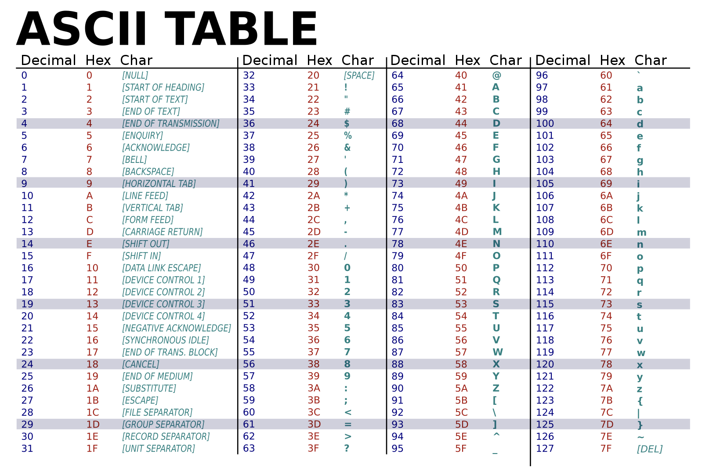
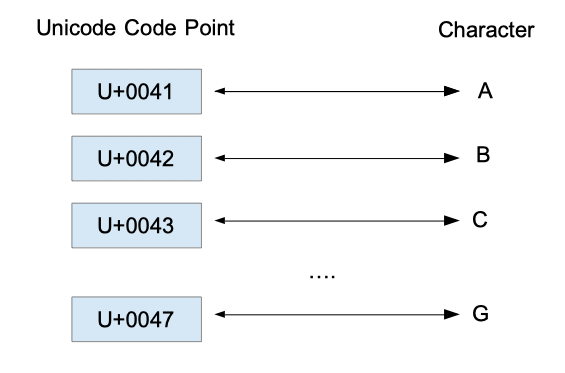
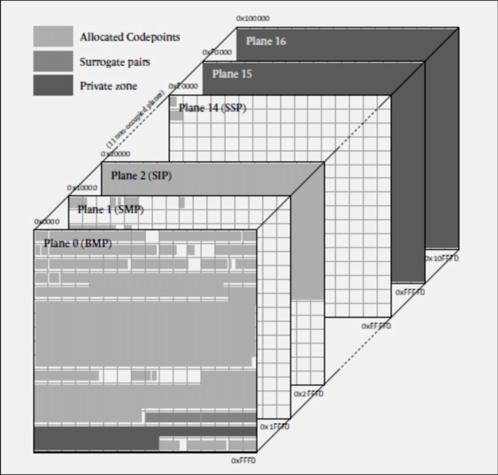
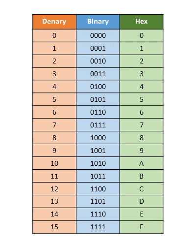
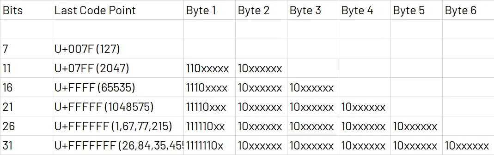
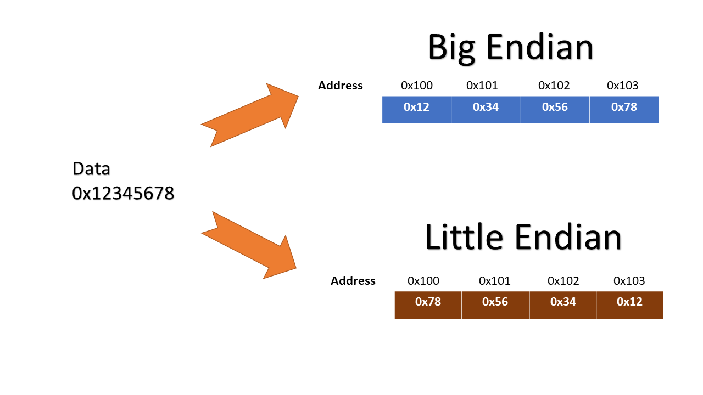

## 유니코드 (Unicode)

### ASCII의 등장과 ASCII 확장이 빚은 혼란

초창기 컴퓨터에서는 아스키(ASCII)라는 문자 인코딩 방식을 사용했다. 문자 인코딩이란 문자나 기호등을 컴퓨터가 이용할 수 있는 어떠한 신호로 만드는 것을 의미한다[^1]. 아스키의 경우 위 표처럼 특정 숫자 코드에 문자를 매핑하는 문자 인코딩 방식이다. 예를 들어 아래 테이블 처럼 10진수 $64$ 는 $A$ 를 나타내는 식이다.



아스키가 널리 쓰이게 되면서, 7비트를 사용하던 기존 아스키에 1비트를 추가하여 총 8비트로 추가적인 문자를 표현하는 등의 여러 아스키 확장이 등장한다. 이런 확장들은 기존 아스키의 표현 한계를 뛰어넘을 수 있는 수단이 되었지만, 동시에 표준화 되지 않은 인코딩 방식은 많은 혼란을 빚었다. 이런 확장이 국가, 컴퓨터 제조사 등에 따라 다르게 매핑되어 있어, 서로의 문자가 깨지거나 이상하게 보이는 문제가 생긴 것이다.

### 다국어 처리가 불가능했던 ANSI 표준

이런 혼란을 잠재우기 위해 ANSI 표준 위원회는 ANSI 표준이라는 것을 정하게 된다. ANSI는 원래 7비트를 사용하던 아스키를 8비트로 확장했다. 그리고 기존 0부터 127까지의 코드 값은 아스키의 것을 그대로 사용하면서, 나머지 확장된 128부터 255까지의 코드 값은 언어별 문자를 매핑할 수 있도록 만들었다.

하지만 여전히 하나의 컴퓨터에서 여러나라의 언어를 동시에 처리하는 것은 불가능했고, 또한 겨우 1비트를 확장해서는 아시아의 문자를 커버하기에는 턱 없이 부족했다 (현재 유니코드에 할당된 한중일 통합 한자의 개수만 10만개 가까이 된다 [^2]).

### 세상 모든 문자를 지원하기위해 등장한 Unicode

이런 과정을 거쳐 유니코드가 세상에 등장하게 된다. 유니코드는 전세계 모든 문자를 어떤 환경의 컴퓨터에서도 일관되게 표현할 수 있도록 하는 것을 목표로 만들어진 표준이다.

에플컴퓨터, IBM, 마이크로소프트 등이 컨소시엄으로 설립한 Unicode가 1990년에 첫버전을 발표하였고, 이후 ISO/IEC JTC1 에서 1995년 9월에 국제표준으로 제정되었다고 한다.

유니코드에도 버전이 있다. 글을 쓰고 있는 2024년 5월 현재 기준으로 2023년에 발표된 15.1 버전이 가장 최신이다. 유니코드에 할당된 모든 문자를 보고 싶다면, unicode.org 에서 제공되는 [Unicode 15.1 Character Code Charts](https://www.unicode.org/charts/) 를 참고하자.

이 포스팅에서는 유니코드의 구조를 알아보고, 어떻게 유니코드가 전세계 문자를 커버할 수 있는지를 알아본다.

## 코드 포인트 (Code Point)



유니코드도 아스키와 마찬가지로 특정 숫자 코드에 문자를 매핑하는 방식으로 구성되어 있다. 이때 특정 유니코드 문자에 부여되어 있는 고유한 16진수 숫자 값을 코드 포인트라고 한다. 코드 포인트는 이 숫자 앞에 접두어로 `U+` 를 붙여서 표현한다. 예를 들어 $A$ 라는 문자에 할당된 숫자는 0x0041[^3] 인데, 이를 코드 포인트로 표현하면 `U+0041` 이 된다.

종종 `\u` 라는 접두어가 사용될 때도 있는데, 이는 Unicode Escape라고 불리며 프로그래밍 언어에서 유니코드 문자를 표현하기 위해서 사용된다[^4].

```kotlin
fun main() {
    println("\u0041") // A가 출력된다.
}
```

유니코드 15.1 기준으로 코드 포인트 영역은 `U+0000` 부터 `U+10FFFF` 까지 존재한다.

## 유니코드 평면과 영역

유니코드에는 유니코드 문자를 특정 범위로 묶어낸 단위인 유니코드 평면과 유니코드 영역이 존재한다. 유니코드 평면과 유니코드 영역에 대한 자세한 정보와 할당된 문자들은 위키백과 [유니코드 평면](https://ko.wikipedia.org/wiki/%EC%9C%A0%EB%8B%88%EC%BD%94%EB%93%9C_%ED%8F%89%EB%A9%B4) 과 [유니코드 영역](https://ko.wikipedia.org/wiki/%EC%9C%A0%EB%8B%88%EC%BD%94%EB%93%9C_%EC%98%81%EC%97%AD) 문서에 아주 잘 정리되어 있으며, 여기서는 간략히만 설명한다.

### 유니코드 평면 (Unicode Plane)



유니코드 평면은 유니코드 문자를 여러개의 논리저인 평면으로 나눈것을 의미한다. 각 평면은 $2^{16}$ 개, 즉 65536개의 유니코드 문자가 존재하며, 현재는 0 ~ 16번까지 17개의 평면이 존재한다.

#### 0번 - 기본 다국어 평면 (BMP, Basic Multilingual Plane)

- **범위**: U+0000 ~ U+FFFF
- **설명**: 거의 모든 근대 문자와 특수 문자가 포함되어 있으며, 대부분은 한글과 한중일 통합 한자가 포함되어 있다.

#### 1번 - 보충 다국어 평면 (SMP, Supplementary Multilingual Plane)

- **범위**: U+10000 ~ U+1FFFF
- **설명**: 옛 문자, 음악 기호, 수학 문자 등이 포함되어 있다.

#### 2번 - 상형 문자 보충 평면 (SIP, Supplementary Ideographic Plane)

- **범위**: U+20000 ~ U+2FFFF
- **설명**: 초기 유니코드에 포함되어 있지 않던 한중일 통합 한자가 포함되어 있다.

#### 3번 - 상형 문자 제3 평면 (TIP, Tertiary Ideographic Plane)

- **범위**: U+30000 ~ U+3FFFF
- **설명**: 갑골 문자, 금문, 소전, 추가 한중일 통합 한자, 기타 옛 상형문자를 위해 예약된 영역이다.

#### 4번 ~ 13번 - 미할당 평면

- **범위**: U+40000 ~ U+DFFFF
- **설명**: 아직 할당되어 있지 않으며, 미래에 사용하기 위해 예약되어 있다.

#### 14번 - 보충 특수 목적 평면 (SSP, Supplementary Special-purpose Plane)

- **범위**: U+E0000 ~ U+EFFFF
- **설명**: 특수 목적용 기호 등이 포함되어 있다.

#### 15번 ~ 16번 - 사용자 영역 평면

- **범위**: U+F0000 ~ U+10FFFF
- **설명**: 사용자 영역으로, 특정 업체나 사용자별로 할당하여 사용하기 위해 존재하는 평면이다. 호환성은 보장되지 않는다.

### 유니코드 영역 (Unicode Block)

유니코드 영역은 특정 범위의 연속된 유니코드의 코드 포인트 집합을 의미한다. 각 영역에는 고유한 이름이 존재하고, 각 영역의 코드 포인트는 중복되지 않는다.

예를 들어 BMP의 `U+0000` 부터 `U+007F` 까지 하나의 영역으로 묶이며, 로마자 기본(Basic Latin) 이라고 명명되어 있다[^5].

## 유니코드 인코딩

많은 사람들이 혼동하는 부분일텐데, 유니코드 자체는 문자 인코딩 방식이 아니다. 만약 '유니코드'를 어떠한 문자 인코딩 체계로 알고 있었다면, 유니코드를 잘못 이해하고 있는 것이다. 유니코드는 단순히 특정 숫자와 표현할 문자를 매핑하고 있는 체계로 바라봐야하며, 이 숫자 코드를 컴퓨터에서 어떻게 인코딩하여 다루는지는 별개의 문제이다.

유니코드를 인코딩 하는 방식은 매우 많다. 이중 가장 널리 사용되고 있는 인코딩 방식인 UTF-8, UTF-16, UTF-32 방식에 대해서 알아보자.

> 💡 [이 웹사이트](https://onlinetools.com/unicode/convert-unicode-to-binary)에서 유니코드 문자가 실제 바이너리로 어떻게 표현되는지 확인할 수 있다.



추가로 직접 인코딩 과정을 따라해보기 편하도록 10진수-2진수-16진수 테이블을 함께 첨부한다.

### UTF-8

UTF-8은 유니코드를 위한 가변 길이 문자 인코딩 방식이다. 대부분의 웹사이트의 경우 UTF-8을 사용한다.

UTF-8은 문자 하나를 표현하기 위해 적게는 1바이트에서 많게는 4바이트를 사용한다.

- **1바이트**: ASCII 코드 전체
- **2바이트**: 일부문자 (제어문자, 라틴어, 음성기호, 조정문자, 결합문자, 그리스어, 키릴 문자, 아르메니아어, 히브리어, 아랍어, 시리아어, 타나문자, 은코문자)
- **3바이트**: 대부분의 문자들. 한국어, 중국어, 일본어는 여기에 포함된다.
- **4바이트**: BMP에 속하지 않는 문자 전부

UTF-8는 1바이트부터 4바이트까지 문자를 나타내기위해 사용되는 비트 패턴이 다르다. 1바이트만 사용되는 문자는 첫 비트에 0을 두고, 나머지 7비트로 문자를 표현한다. 참고로 1바이트로 표현되는 문자의 경우 ASCII의 인코딩 체계와 완전 호환된다.

문자를 표현하는데 2바이트 이상 사용되는 경우, 아래 표 처럼 첫번째 바이트에 총 몇바이트를 사용하는지 알리는 비트를 먼저 넣는다 (2바이트는 110, 3바이트는 1110, 4바이트는 11110). 그리고 이후 바이트는 10으로 시작된다.



이런 패턴을 사용함으로써 첫 바이트 시작 패턴이 문자의 시작임을 명확히 나타내고, 이후 10으로 시작하는 연속 바이트는 문자의 나머지 부분임을 명시할 수 있다. 즉, 임의의 바이트 시퀀스에서 명확하게 문자의 경계를 나타낼 수 있는 것이다. 이를 통해 데이터 손상, 전송 오류 상황에서도 명확히 문자의 시작과 끝을 식별할 수 있다.

더 자세히 이해하기 위해 직접 유니코드 문자를 UTF-8로 인코딩 해보자.

#### 1바이트 (U+0000 ~ U+007F)

이 범위에 속하는 문자를 표현하기 위해서는 최대 7비트까지 필요로 한다. 바이트의 첫번째 비트는 0으로 표현되고, 나머지 7비트로 문자를 표현한다.

$A$ 라는 문자를 UTF-8로 인코딩해보자. $A$의 코드 포인트는 `U+0041` 이고, 이를 이진수로 나타내면 0100 0001 이며, 7비트만 취하면 1000001이다. 맨 앞에 0을 두고 7비트를 이어 붙이면, **0<u>1000001</u>** 이 된다.

#### 2바이트 (U+0080 ~ U+07FF)

이 범위에 속하는 문자를 표현하기 위해서는 최대 11비트까지 필요로 한다.

$©$ 라는 문자를 UTF-8로 인코딩해보자. 해당 문자의 코드 포인트는 `U+00A9` 이므로 UTF-8에서 2바이트로 표현되는 문자이다. 코드 포인트를 이진수로 나타내면 0000 0000 1010 1001 이다. 여기서 11비트만 취하면 00010101001 이다.

바이트별 인코딩:

- **첫번째 바이트**: 맨 앞에 110을 두고, 상위 5비트를 가져온다 → **110<u>00010</u>**
- **두번째 바이트**: 맨 앞에 10을 두고, 나머지 6비트를 가져온다 → **10<u>101001</u>**

따라서 $©$ 는 `1100001010101001` 로 인코딩된다.

#### 3바이트 (U+0800 ~ U+FFFF)

이 범위에 속하는 문자를 표현하기 위해서는 최대 16비트까지 필요로 한다.

$※$ 라는 문자를 UTF-8로 인코딩해보자. 해당 문자의 코드 포인트는 `U+203B` 이므로 UTF-8에서 3바이트로 표현되는 문자이다. 코드 포인트를 이진수로 나타내면 0010 0000 0011 1011 이다. 여기서 16비트만 취하면 0010000000111011 이다.

바이트별 인코딩:

- **첫번째 바이트**: 맨 앞에 1110을 두고, 상위 4비트를 가져온다 → **1110<u>0010</u>**
- **두번째 바이트**: 맨 앞에 10을 두고, 이어지는 6비트를 가져온다 → **10<u>000000</u>**
- **세번째 바이트**: 맨 앞에 10을 두고, 나머지 6비트를 가져온다 → **10<u>111011</u>**

따라서 $※$ 는 `111000101000000010111011` 로 인코딩된다.

#### 4바이트 (U+10000 ~ U+10FFFF)

이 범위에 속하는 문자를 표현하기 위해선 최대 21비트까지 필요로 한다.

$𓂀$ 라는 문자를 UTF-8로 인코딩해보자. 해당 문자의 코드 포인트는 `U+13080` 이므로 UTF-8에서 4바이트로 표현되는 문자이다. 코드 포인트를 이진수로 나타내면 0001 0011 0000 1000 0000 이다. 여기서 21비트만 취하면 000010011000010000000 이다.

바이트별 인코딩:

- **첫번째 바이트**: 맨 앞에 11110을 두고, 상위 3비트를 가져온다 → **11110<u>000</u>**
- **두번째 바이트**: 맨 앞에 10을 두고, 이어지는 6비트를 가져온다 → **10<u>010011</u>**
- **세번째 바이트**: 맨 앞에 10을 두고, 이어지는 6비트를 가져온다 → **10<u>000010</u>**
- **네번째 바이트**: 맨 앞에 10을 두고, 나머지 6비트를 가져온다 → **10<u>000000</u>**

따라서 $𓂀$ 는 `11110000100100111000001010000000` 로 인코딩된다.

### UTF-16

UTF-16은 단일 문자를 표현하는데, 2바이트 또는 4바이트가 활용되는 가변 길이 문자 인코딩 방식이다. 대표적으로 Java와 Kotlin 은 유니코드 문자를 처리하는 방법으로 UTF-16을 채택한다.

> 💡 유니코드에서 한글의 코드 포인트를 16비트로 표현할 수 있어서, 한글을 UTF-16으로 인코딩하면 UTF-8로 인코딩한 것보다 용량을 덜 차지한다.

#### Surrogate Pair

UTF-16를 사용하면, 기본 다국어 평면 (U+0000 ~ U+FFFF) 에 속하는 문자들은 별도 인코딩 과정 없이 그대로 표현할 수 있다. UTF-16는 기본적으로 2바이트를 사용하기 때문이다.

그런데 U+10000 부터는 2바이트만으로는 문자를 표현할 수 없다. U+10000 ~ 에 해당하는 영역을 써로게이트 영역이라고 하며, 이 영역에 포함된 문자는 2바이트 값 2개를 합쳐서 표현한다. 이때 사용되는 2바이트 값 2개의 쌍을 Surrogate Pair 라고 부른다.

써로게이트 쌍은 High Surrogate 와 Low Surrogate 로 나뉜다. 계산법은 아래와 같다.

- 우선 코드 포인트에서 0x10000 을 뺀다. 이 값을 A라고 하자.
- **High Surrogate = A / 0x400 + 0xD800**
- **Low Surrogate = A % 0x400 + 0xDC00**

> 💡 [여기](https://russellcottrell.com/greek/utilities/SurrogatePairCalculator.htm)에서 특정 문자의 Surrogate Pair 를 직접 계산해볼 수 있다.

### UTF-32

문자를 표현하는데 4바이트를 고정으로 사용한다. 유니코드의 모든 코드포인트를 직접 표현할 수 있다. 즉, 별도의 인코딩 처리가 필요 없다는 이야기다.

유니코드 코드 포인트의 범위는 앞서 이야기했듯 U+10FFFF 까지인데, 0x10FFFF 는 24bit, 즉 3바이트만 사용 하면 직접 표현이 가능하기 때문이다.

## BOM (Byte Order Mark)

### Byte Order



컴퓨터는 메모리에 데이터를 저장할 때 바이트 단위로 저장한다. 이때 이 바이트를 어떤 순서대로 저장하느냐에 따라 Big Endian, Little Endian 시스템으로 나뉜다.

- **Big Endian**: 상위 바이트를 메모리의 낮은 주소에 저장하는 방식이다. 평소 우리가 사용하는 선형적인 형태로 저장된다고 보면 된다. 예를 들어 0x12345678 를 저장한다면, 0x12, 0x34, 0x56, 0x78 순서대로 저장된다.
- **Little Endian**: 상위 바이트를 메모리의 높은 주소에 저장하는 방식이다. 위와 같이 0x12345678 을 저장한다면, 0x78, 0x56, 0x34, 0x12 순서대로 저장된다.

### BOM

이런 문제를 해결하기 위해 문서 맨 처음 눈에는 보이지 않는 특정 바이트를 넣어, 정확히 어떤 인코딩 방식이 사용되었는지 알려야한다. 이때 넣게되는 바이트를 BOM (Byte Order Mark) 라고 한다.

| 인코딩 방식          | Byte Order Mark(BOM) |
| -------------------- | -------------------- |
| UTF-8                | EF BB BF             |
| UTF-16 Big Endian    | FE FF                |
| UTF-16 Little Endian | FF FE                |
| UTF-32 Big Endian    | 00 00 FE FF          |
| UTF-32 Little Endian | FF FE 00 00          |

특이한점은 UTF-8은 BOM 이 Big Endian 과 Little Endian 구분 없이 하나라는 점이다. 그 이유는 UTF-8 방식에서는 문자를 나타내는 첫번째 바이트에 특정한 비트 패턴이 존재하기 때문이다. 예를 들어 2바이트로 표현된 UTF-8 문자는 첫번째 바이트가 110 로 시작한다. 이런 패턴을 통해 Big Endian, Little Endian 구분 없이 올바른 순서로 문자를 해석할 수 있는 것이다.

따라서 UTF-8의 BOM은 이 문서가 UTF-8 로 인코딩 되었다는 사실 정도만 알리는 용도이며, 따라서 UTF-8의 경우 BOM 사용이 필수가 아니다.

## 참고

- https://yhyacinth.github.io/general/2015/05/18/learn-about-unicode.html
- http://www.ktword.co.kr/test/view/view.php?m_temp1=670
- https://ko.wikipedia.org/wiki/UTF-8
- https://ko.wikipedia.org/wiki/유니코드_평면
- https://ko.wikipedia.org/wiki/유니코드_영역
- https://kkokkal.tistory.com/968

[^1]: https://ko.wikipedia.org/wiki/문자_인코딩
[^2]: https://ko.wikipedia.org/wiki/한중일_통합_한자
[^3]: 앞에 붙은 0x 는 숫자가 16진수임을 알려주는 접두어다. 참고로 0b 는 2진수를 나타낸다.
[^4]: https://dencode.com/string/unicode-escape
[^5]: https://ko.wikipedia.org/wiki/로마자_기본
