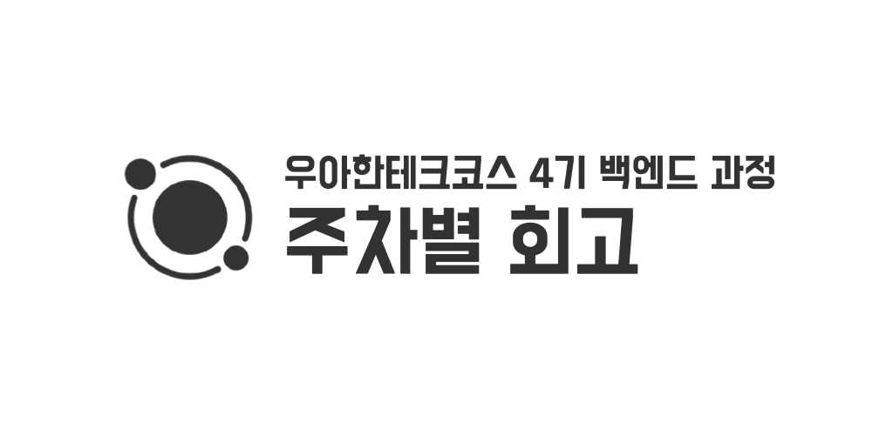

## 우테코 회고를 시작하며

이번주부터 우아한테크코스 4기 백엔드 과정이 시작되었다. 일일 회고를 하기에는 너무 많은 포스팅이 만들어질 것 같아서 주 단위로 회고를 하려한다. 글의 완성도도 중요하지만, 꾸준히 하는 것이 더 중요하므로 적어도 주차별 회고는 크게 문장이나 글의 완성도에 집중하기보다는 회고하고 기록하는 행위 자체에 집중하려한다.

### 4F 회고

회고를 계획하며 4F 회고 방법에 대해 알게되었다. 4F 회고는 **사실 (Fact), 느낌 (Feeling), 교훈 (Finding), 향후 행동 (Future Action)** 순서대로 회고하는 방법이다. 4F 에서 Finding 까지만 회고하면 3F 회고, 마지막에 Feedback 이 추가되면 5F 회고라고 한다. 각 단계를 조금 더 자세히 설명하면 아래와 같다.

- **Fact** : 무슨 일이 있었는지, 어떤 일을 했는지
- **Feeling** : 어떤 감정을 느꼈는지
- **Finding** : 어떤 지식과 인사이트를 얻게 됐는지
- **Future Action** : 앞으로 무엇을 할 계획인지

그런데, 평소 평범한 줄글로 자연스럽게 회고하다보니 막상 4F 형식에 맞춰 회고를 작성해보니 나랑 잘 맞지 않는다는 생각이 들었다. 일단 알아만 두고, 나중에 활용해 보는 것으로. (사실 우테코 이전 기수분들의 글을 살펴보니 우테코 내에서 4F 회고를 사용하는 것 같다)

## 오리엔테이션

우테코 첫날에는 간단한 오리엔테이션이 진행되었다. 우테코 비전, 교육과정, 생활수칙 등 전반적인 내용등을 전달받았다. 우아한테크코스 운영을 총괄하는 박재성 이사님이자, 백엔드 과정의 캡틴인 포비의 정신교육 (이라쓰고 명강의라고 읽는다 😁 ) 시간도 갖게 되었다. 포비가 생각하는 좋은 교육과 학습에 대한 생각들이 내가 해온 생각들과 상당 부분 일치한다는 느낌이 들어 조금 가슴이 벅찼다.

포비의 강의를 듣고 내가 평생 생각해온 것들이 틀리지 않았음을 알게되었고, 너무나 감사해 포비에게 슬랙으로 다소 장문의 메세지를 적어 DM 을 드렸다. 얼마 지나지 않아 따뜻한 답장이 오게 되었다. 포비가 교육과 크루들에게 진심이라는 것을 알게되었다.

### 아이스 브레이킹

오리엔테이션 중간에는 아이스브레이킹을 위한 작은 게임들도 준비되어 있었다. 그 중 '몸으로 말해요' 게임도 준비되어 있었는데, 하필이면 내가 몸으로 표현하는 사람으로 지목되었다. 평생 이런 레크리에이션에서 주목받는 역할을 하지 않았는데, 그것도 하필이면 온몸을 움직이는 몸으로 말해요라니.

내가 설명할 차례가 되니 머리속이 하얘졌다. 음식을 주제로 설명을 해야하는데, 족발을 표현할 방법이 생각이 나지 않아 이전에 표현한 치킨과 똑같이 표현하며 크루들이 알아맞추지 못해 굉장히 민망했다 😅 . 그래도 어찌저찌 족발을 무사히 표현하고, 이후 음식은 순탄하게 넘어가서 다행이다. 그래도 다 추억이 되지 않겠는가.

### 코딩을 배우는 건 왜 더럽게 어려울까? (Why Learning to Code is So Damn Hard)

이 단락은 [Thinkful.com 의 에릭 트라우트먼 (Erik Trautman)이 작성한 글](https://www.thinkful.com/blog/why-learning-to-code-is-so-damn-hard/) 에서 가져온 이야기이다.

왜 코딩은 배우기 더럽게 어려울까? 위의 자료는 자료의 밀도, 아래 자료는 학습해야하는 지식의 범위이다. 왼쪽으로 갈수록 초급자, 중앙은 중급자, 오른쪽으로 갈수록 전문가라고 생각하면 된다. 보이는 것과 같이 초급자에서 중급자로 갈 수록 학습 자료의 수는 적어지고, 학습해야하는 지식의 범위는 점점 늘어난다.

### 어떻게 학습 해야 하는가?

#### 연습, '목적 의식 있는'

무엇을 잘하기 위해서는 연습이 정말 중요하다. 하지만, 연습만 반복하면 정말 무엇이든지 잘 하게 될까? 반복하는 연습의 수준이 일정 난이도에 머물러있다면, 성장하기 어렵다. 자신을 계속 Comfort Zone 밖으로 밀어내고, 내 현재 능력을 살짝 상회하는 연습을 계속 시도해야한다. 이런 연습은 항상 그 연습으로 이루고자 하는 명확하고 구체적인 목표를 가지고 진행해야한다.

#### 태도

자신의 의지력을 믿기 보다는 몰입할 수 있는 환경을 조성하자. 남들과 경쟁하지 말고, 어제의 나하고 비교하자. 이건 내가 2021년 회고에도 써놓은 말이기도 하다.

또한 자신의 약점, 모르는 것을 빠르게 인정하고 아는체 하지말자. 모르는 것을 부끄럽다고 생각하고 방어적이고 소극적인 태도로 학습하면, 성장하기 어렵다. 최근에 많이 느낀것이지만, 계속 아는 척 하다보면 그 아는 척에 자기자신도 속아 넘어가 어느새 자기 객관화가 어려워지는 지경에 이르는 것 같다.

동의되지 않는 권위에 굴복하지 말고 불합리한 권위에 복종하지 말자. 포비가 언제나 강조하는 이야기이다. 모든것을 의심하고, 다르게 바라보려 노력해야한다. 비판적 사고 (Critical Thinking) 라고도 한다. 기존의 틀을 항상 의심하고, 틀을 부숴보자. 남들과 다르게 살아보자.

## 환경의 중요성

아무래도 모두 간절함을 갖고, 쉽지 않은 선발 과정 끝에 선발된 크루들이 모인 환경이라서 그런지 모두 학습에 열정적이다. 살면서 이렇게 강의 중에 질문이 나오는 것을 처음 보았다.

질문에서 멈추는 것이 아니라 크루들이 자발적으로 강의 내용을 정리한 것을 공유해주기도 한다. 이런 열정적인 환경과 귀감이 될 만한 사람들 속에서 10개월간 공부할 수 있음에 너무나도 감사하다. 나도 누군가에게 좋은 영향을 주는 사람이 되고 싶다.

## 미션 진행

### 페어 프로그래밍

우테코 미션의 대부분은 페어 프로그래밍으로 진행된다. 두명으로 이루어진 페어가 하나의 모니터, 키보드, 마우스를 사용하며 번갈아가며 코드를 작성하는 방법이다. 페어 프로그래밍은 더 자주, 빠르게, 꾸준하게 리뷰를 받기 위해 사용하는 방법론이다. 즉각적 피드백으로 코드의 품질이 향상될 수 있다.

페어 프로그래밍을 하기 위해서는 많은 방법이 있지만, 우테코에서는 키보드와 마우스를 직접 잡고 코드를 작성하는 **Driver**, 옆에서 Driver 의 코드를 보며 계속 피드백 하는 **Navigator** 로 역할을 나누어 진행한다.

첫 페어는 토닉과 매칭되었다. 토닉은 나보다 훨씬 자바에 능숙해보였다. 기초적인 문법도 헷갈려서 토닉에게 계속 물어봤던 기억이 난다. 다행히 토닉은 정말 좋은 사람이었고, 많은 지식을 배워가는 계기가 되었다.

내가 부족하면 페어에게 폐를 끼칠수도 있다는 생각에, 자바와 객체지향, 디자인패턴 학습에 좀 더 에너지를 많이 쏟아야겠다는 생각이 들었다.

### TDD

우테코 과정에서 가장 처음에 가르쳐주는 것은 프로그래밍 언어라던가 프레임워크 사용법이 아니다. 우테코에서 가장 처음 배우는 것은 **TDD** 이다. TDD 는 **Test Driven Development** 의 줄임말이다. 한국어로는 **테스트 주도 개발**이라고 한다.

TDD 의 사이클은 위 그림과 같다. 제일 먼저 **RED**, 실패하는 테스트 코드를 작성한다. 아직 작성하지 않은 클래스, 메소드를 사용하면 당연히 컴파일 에러가 발생할 것이다. 컴파일 에러가 발생하지 않더라도, 아직 구현하지 않은 로직이 존재하면 당연히 테스트는 실패할 것 이다. 하지만, 이미 클래스, 메소드, 로직이 구현되어 있다고 생각하고, 코드를 작성한다.

두번째는 **GREEN**, 테스트를 통과하는 **최소한의 코드**를 작성한다.

마지막으로 **REFACTOR**, RED 에서 GREEN 으로 만들기 위해 작성한 최소한의 코드를 리팩토링 한다. 이때, 이전에 작성한 테스트 코드에 영향을 주지 않도록 조심한다.

코드를 작성하며 Private 메소드는 어떻게 테스트 해야할지 궁금했는데, http://shoulditestprivatemethods.com 라는 웹사이트를 알게 되었다.

HTML 주석으로 추가 내용이 있다.

> 프라이빗 메서드 테스트를 고려한다는 것은, 당신이 코드에 책임을 제대로 할당하지 않은 것 이다.

이라고 한다. 아직 '책임' 에 대해 제대로 이해가진 않지만, 열심히 하다보면 완벽히 이해가 가겠지?

## 코드 리뷰

각 미션을 진행하면, 현업에서 종사하고 계시는 리뷰어분이 내 코드를 리뷰해주신다. 사실 금요일날 리뷰 요청을 드리고, 주말에 리뷰를 받게 되어 사실 아직 제대로 리뷰를 살펴보지는 못했다. 주말엔 그래도 회고하고 쉬는 것에 집중해야 10개월간 긴 레이스를 지치지 않고 끝낼 수 있다는 생각 (이라 쓰고 핑계라고 읽는다) 이 들었기 때문이다.

다음주부터는 리팩토링을 하는 2단계이기 때문에 페어 프로그래밍 보단 혼자 공부할 시간이 많아지는데, 그때 달린 리뷰를 읽어보며 리팩토링 해야겠다. 이전에 사둔 '이펙티브 자바'와 오늘 산 '이것이 자바다' 를 읽어보며 리팩토링 해야겠다.

## 소프트스킬

우테코는 프로그래밍 능력 뿐 아니라 말하기, 글쓰기, 커뮤니케이션 능력 등 소프트 스킬도 굉장히 강조한다. 개발자의 소프트스킬 능력의 중요성은 많이 공감간다. 결국 함께 일하는 것은 컴퓨터가 아니라 사람이니까.

실제로 매 레벨 별 글쓰기 미션까지 수행해야한다고 한다. 글쓰기야 블로그 글 작성을 하루이틀 해온게 아니라서 크게 어려울 것 같지는 않다. 그런데, 아이스브레이킹 겸, 소프트스킬 향상 겸으로 우테코에서는 기수별로 모든 크루가 연극을 해야한다고 한다.

그나마 코로나 상황이라서 모이지 못하니 줌을 이용해서 보이는 라디오로 진행하긴 하지만... 다른 크루들은 모두 한 인싸력 하시는 것 같은데 😭😭 부담돼 죽겠다. 이런 시련을 극복해야 더 훌륭한 개발자가 되는 것 이겠지?... 맞지?...

## 새롭게 배운 프로그래밍 지식

자바는 주력으로 사용해본적이 전혀 없어 여전히 낯설다. 이번 한주간 새로 알게된 지식은 아래와 같다. 새롭게 배운 프로그래밍 관련 지식은 회고에서는 키워드만 나열하고, 자세한 내용은 별개의 포스트로 정리해보는 편이 좋겠다.

- JUnit 의 `@ParamiterizedTest`, `@ValueSource`, `@CsvSource`, `@DisplayName` 어노테이션
- 메소드 추출 리팩토링
- 자바도 타입스크립트처럼 `var` 키워드를 사용하면 타입추론 할 수 있다.
- 함수형 인터페이스
- 랜덤의 테스트를 위해 DI (의존성 주입) 패턴을 사용해봤는데, 이제야 조금 DI 개념이 그려지는 것 같다.
