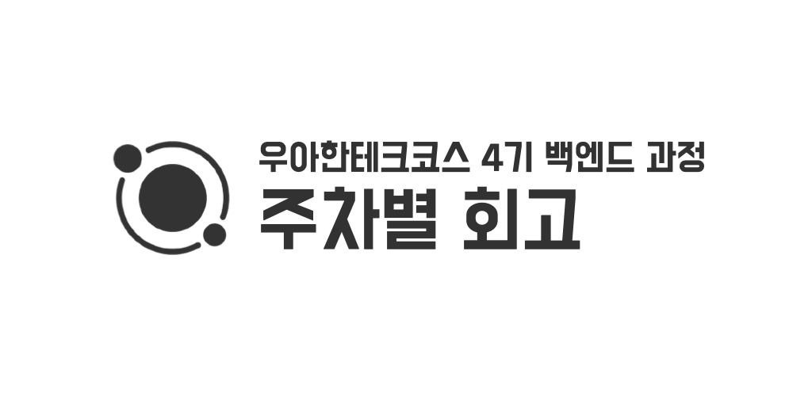

## ‘왜?’ 라는 질문 던지는 연습

최근에 꽤나 무언가 헤맨 경우가 많은 것 같다. 무엇을 해야할지 몰라 헤맬때도 있었고, 제대로 이해하지 못한 패턴을 코드에 적용해보며, 문제 상황에 봉착하여 헤맬때도 있었다. 헤매고 있을 때는 한걸음 뒤로 떨어져 문제상황을 살펴보자. 잠시 하던일을 멈추고 ‘왜 해야 하지?’, ‘왜 이런 거지?’, ‘이건 왜 필요한거지?’, ‘사람들은 왜 이게 좋다고 하는걸까?’ 라고 되물어봐야하는 것 같다. ‘왜?’ 라는 질문은 본질에 가까워지기 위한 도구라고 생각한다. 항상 의식적으로 ‘왜?’ 라는 질문을 던지려 노력해야할 것 같다.

## 조바심

‘남하고 비교하지 말고, 항상 어제의 나와 비교해야한다’ 라고 머리로는 항상 생각하고 있는데, 생각대로 잘 되지는 않는다. 잘 하는 사람이 눈 앞에 보이지 않으면 차라리 어제의 나에게만 시선을 집중할 수 있겠는데, 눈 앞에 자꾸 나보다 훨씬 잘하는 사람만 보이게 되니 위축되는건 어쩔 수 없는 것 같다.

포비는 의식적으로 잘하는 사람을 무시할줄도 알아야한다고 한다. 잘하는 사람을 계속 의식하게 되면, 내가 당장 중요하게 집중해야 할 것들을 되려 집중하지 못하게 된다. 기초가 부족한데, 나보다 잘하는 사람이 공부하고 있는 것들을 억지로 붙잡고 있으면 재미도 없고, 힘만 들것이다.

코치분들은 우테코 혹은 주변 크루에 끌려가지 말아야 한다고 한다. 천천히 성장해도 괜찮으니까.. 지속 가능한 성장에 집중하자. 쉽지 않겠지만.

## 지금 나는 무엇을 집중해야 할까?

다른 크루들은 이펙티브 자바를 공부하고, 디자인 패턴을 공부하고, 여러 멋진 것들을 공부하고 있지만 아직 나는 자바의 문법도 많이 어색한 상태이다. 지금은 자바 문법, JDK, 객체지향 등 기초적인 것에 집중해야할 것 같다. 아직 객체간 책임을 분배하는 것도 많이 어려운 수준이다. 기초가 불안한 상태에서 더 많은 것을 공부해봤자, 이해가 되지도 않고 따라서 머리속에 들어오지도 않을 것 이다.

모르는 자바 개념이 나올 때 마다 해당 개념에 대해 깊이 공부해보면서 동시에 ‘객체지향의 사실과 오해' 책으로 객체지향의 전반적인 철학에 익숙해지는데 집중하도록 하자.

물론 지금 이펙티브 자바 스터디에 참여하고는 있다. 하지만, 깊이 공부하는 스터디라기 보다는 개념과 여러 키워드에 익숙해져, 문제에 마주쳤을 때 관련된 내용이 이펙티브 자바에 있었다는 사실을 떠올리기 위한 목적의 스터디이니 살짝 논외라고 생각한다.

## 주변의 평균

3주차는 OT 때 포비가 해준 이야기가 조금 많이 떠오르는 한주였다. OT 때 포비는 해빗(Habbit) 이라는 책을 잠깐 언급하며, 사람의 의지를 믿지 말고 환경을 바꾸라는 이야기를 해주었다. 맥락상 이때 환경의 의미는 주변의 유혹 (TV, 게임기 등)을 의미한 것 이겠지만, 조금 의미를 넓게 바라본다면 주변 사람도 환경에 포함될 수 있을 것 이다.

유유상종이라는 말이 있다. 어떤 사람을 알고 싶다면, 그 사람의 친구를 보라는 이야기가 있다. 주변의 평균 수준은 일반적으로 나의 수준과 같다. 내 생각에 사람은 본능적으로 주변의 평균 정도에 안주하는 경향이 있는 것 같다. 평균의 범위에 있는 나를 바라보면, 적어도 자신이 평균 이하는 아닐 것이라는 안도감이 느껴질 것 이다. 평균 이상이 되는 것도 좋지만, 그건 힘드니까. 그렇기 때문에 주변의 평균을 그대로 둔 채 혼자만 성장하려고 발버둥 쳐봤자 동기 부여도 되지 않고, 노력을 지속하기도 힘들 것 이다.

그래서 내가 평균을 상회하려는 노력보다, 주변 평균이 나를 상회하는 환경을 조성하는것이 성장에 있어 더 쉬운 방법이라고 생각된다. 주변의 평균을 내 수준보다 높은 상태로 유지하면, 자연스럽게 평균에 나 자신을 맞추려 (적어도 집단에서 뒤떨어지지는 않기 위해) 노력하게 될 것이다.

주변의 평균, 주변의 수준... 이런 단어를 써서 좀 염세적(?)이라고 느껴질 수도 있을 것 같은데, 이야기의 요지는 주변에 좋은 사람, 훌륭한 사람, 배울만한 사람을 많이 두자는 이야기다. 그리고 되도록 나보다 뛰어난 사람을 주변에 두면 좋을 것 이다.

감사하게도 (그리고 운이 좋게도) 어렸을 때 부터 본받고 싶은, 배우고 싶은 사람들이 참 많았던 것 같다. 자연스럽게 주변의 평균에 나를 안착시키기 위해 노력해왔고, 그 결과 자연스럽게 주변의 평균도 덩달아 위로 견인되어 성장의 선순환이 되었던 것 같다. 그리고 특히 우아한테크코스에 합류하고 나서는 평균 상승의 폭이 굉장히 커졌다. 열심히 사는 크루만 모여서 그런지, 정말 한명 한명 빠짐없이 본받고 싶은 크루밖에 없다. 너무나도 감사할 따름이다.
